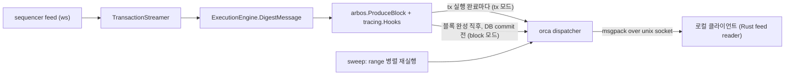

# orca-nitro: 저지연 receipt dispatch 설계

날짜: 2026-07-28
베이스: nitro v3.11.2 (=3599aca) — 프로덕션 배포 버전과 동일 소스

## 목표

Robinhood Chain(RHC) 노드를 직접 운영하며, sequencer live feed로 들어오는 tx가
실행되는 즉시 enriched receipt를 로컬 클라이언트(Rust feed reader)에게 최소 지연으로
전달한다. 동일 파이프라인으로 과거 block range sweep도 지원한다.

## 노드 구성

| 노드 | 스냅샷 | 역할 |
|---|---|---|
| live 노드 | 공식 pruned (hash 스킴) | feed 수신 → 실행 → 즉시 dispatch. L1 reader **유지**(finality·self-healing·pruner), staker/batch-poster/sequencer off, RPC는 디버깅 최소한 |
| sweep 노드 | Titan archive (**path 스킴 + archive**, 매일 재컷) 복원 | catchup off, `sweep` 모드로 range 재실행 → dispatch. path 모드는 HistoricReader로 블록별 과거 state 직접 접근. 사이클마다 Titan 재부트스트랩 (기존 dora-master ops 패턴 유지) |

- 메모리 방침: 캐시(trie/snapshot/database)는 **키우는 방향** — state를 RAM에 상주시켜
  핫패스 디스크 리드를 제거한다. "memory expansion 최소화"는 핫패스 할당·GC 압력
  제거로 달성한다.
- 코드 삭제는 하지 않는다. 안 쓰는 컴포넌트는 config로 끈다 — 성능 이득이 없는 삭제는
  upstream rebase 비용만 늘린다.

## 파이프라인

- tracer: geth v1.16 `core/tracing.Hooks`에서 `OnEnter`/`OnExit`/`OnBalanceChange`만
  등록. `OnOpcode`는 등록하지 않으므로 EVM 인터프리터 핫루프는 무변경 (오버헤드
  실행 시간의 수 % 이내). 재실행 없음 — 본 실행에 훅.
- go-ethereum submodule은 fork하지 않는 것을 목표로 한다. 훅 주입이 vm.Config /
  statedb logger로 불가능한 경우에만 최소 패치를 검토한다.

## Dispatch 모드

| 모드 | 시점 | 비고 |
|---|---|---|
| `tx` (기본) | ProduceBlock 내부에서 tx 하나 실행 완료마다 즉시 | blockHash 없음 (미봉인). 블록 seal 후 block-seal 메시지로 보완 |
| `block` | ProduceBlock 반환 직후, appendBlock(DB commit) **전** | blockHash 포함 가능 |

- 두 모드 모두 commit 전 dispatch이므로, appendBlock 실패 시(디스크 오류 등 극히
  드묾) invalidation 메시지를 전송한다.
- dispatch는 실행 goroutine을 절대 막지 않는다: 실행 스레드는 참조를 버퍼에 넣고
  즉시 복귀, 전용 writer goroutine이 직렬화·소켓 write를 담당.

## 전송 계층

- **unix domain socket (SOCK_STREAM)** + 4바이트 LE length-prefix 프레이밍.
- **msgpack array-mode** (필드명 생략, 위치 기반). Go: `tinylib/msgp` 코드젠
  (`msgp:tuple`), Rust: `rmp-serde` 기본 동작.
- 연결 직후 **hello frame**: schema version 정수. 불일치 시 즉시 에러 — lockstep
  배포 실수 방지. wire-level 하위호환은 요구하지 않는다 (양 프로세스 lockstep 배포).
- **golden frame 테스트 벡터**: 인코딩 결과 바이트를 fixture로 고정. 검증은
  dora-master 배포 시점 체크 (CI 게이트 아님).
- backpressure: **drop-oldest** ring buffer. 모든 메시지에 단조증가 seq — 클라이언트가
  gap 감지. 리스너는 다중 연결 허용 (fan-out).

## 메시지 스키마

### ReceiptMessage (tx당 1개)

- tx: `txHash`, `from`, `to`, `value`, `calldata`, `nonce`, `gas`,
  `effectiveGasPrice`, tx type
- receipt: `status`, `gasUsed`, `cumulativeGasUsed`, `contractAddress`, `logs`
  (address/topics/data), `txIndex`, `blockNumber`, l2 timestamp
- 제외: `logsBloom`, `blockHash`(tx 모드 — block 모드·sweep에선 포함)
- enrichment: `to` 및 transfer 상대방들의 **EOA/contract 플래그** (code 유무,
  블록 내 주소 중복은 캐시로 1회 조회)
- `transfers`: TransferRecord 목록 (아래)

### TransferRecord

top-level value transfer와 internal transfer를 같은 타입으로 통일한다.

| 필드 | 내용 |
|---|---|
| `reason` | call value / selfdestruct 등. gas fee류는 기본 제외 |
| `from`, `to`, `value` | |
| `post_balance_from`, `post_balance_to` | transfer 적용 직후 잔액 |
| `depth` | 0 = top-level, 1+ = internal call depth |
| `reverted` | revert된 subtree의 transfer 여부 |

### 제어 메시지

- hello (schema version), block-seal (tx 모드에서 blockHash 보완), invalidation
  (commit 실패), sweep range 완료 마커.

### 제외 결정

- ERC-20 balance enrichment: 토큰별 slot 의존이라 취약, Transfer 로그로 클라이언트
  계산 가능 — 제외.
- 로그 등장 주소 일괄 조회: unbounded — 제외 (필요시 allowlist로 추후).

## Sweep 모드

- 실행: `nitro` 바이너리의 별도 모드 — feed/L1/RPC/catch-up 전부 스킵, DB **read-only**
  open (live 노드와 datadir 동시 사용 가능), 주어진 range를 재실행 → dispatch → 종료.
- 병렬화: `blocks_reexecutor` 패턴 재사용 — range를 작은 chunk로 분할해 worker 병렬
  실행. **out-of-order dispatch** (block number 태깅, 재정렬은 consumer 몫), chunk/range
  완료 마커 전송.
- 현 병목 분석: `debug_traceChain` 200–250 blk/s의 원인은 EBS 읽기 latency ×
  trie 순차 의존 체인. CPU/IOPS 증설로 해소 불가. 레버:
  1. **디스크 latency 제거** (최대 레버): RAM ≥ DB(~138GiB) 인스턴스로 page cache
     상주, 또는 instance store NVMe
  2. in-process 병렬 range 실행 (RPC/JSON 오버헤드 제거 포함)
- 검증 계획: 구현 완료 후 EC2 신규 기동 → Titan 복원 → 속도·리소스 실측
  (기존 `sweep_bench` ops 패턴 재사용).

## 성능 원칙

- 핫패스(실행 goroutine 경로) 무할당 지향: 메시지 버퍼·transfer 수집 버퍼는
  `sync.Pool` 재사용.
- 핫스팟은 `// PERF:` 태그로 마킹 (perf-marking 규칙).
- tracer는 등록한 훅만 발화 — opcode 훅 금지.

## 브랜치·릴리즈·CI

- `master`: upstream(OffchainLabs/nitro) 미러 전용. orca 커밋 금지.
- `orca/main`: 기본 브랜치 (GitHub default). v3.11.2 베이스 + orca 패치.
- feature 브랜치: `{owner}/{type}/{name}` → orca/main으로 PR.
- upstream 업그레이드: 새 공식 릴리즈 태그 위에 패치 rebase (`orca/rebase/vX.Y.Z`) →
  테스트 → orca/main 갱신. 변경은 신규 파일 위주 + 훅 지점 최소 diff로 유지.
- 릴리즈 태그: `orca-v3.11.2-r1` 형식 (베이스 버전 + 리비전).
- CI (GitHub Actions, ubuntu-24.04 — 노드 배포판 glibc 정합):
  - `orca-v*` 태그 push → 풀 빌드 (`make CBROTLI_WASM_BUILD_ARGS="" target/bin/nitro`,
    Go 1.25.5 + rust + cbindgen 0.29.2 + foundry 1.2.3 + emsdk 3.1.7 — dora-master
    build-nitro 레시피와 동일) → 바이너리 + sha256을 Release asset 업로드
  - PR/push → `go vet` + `go build ./...` 빠른 체크만
  - go mod/cargo/emsdk 캐싱
- dora-master 연동: `build-nitro`(빌더 EC2) ops를 "release asset 다운로드 + sha256
  검증"으로 교체. manifest `binaries` sha256 핀 방식 유지.

## 테스트 전략

- golden frame 인코딩 테스트 (Go 측 fixture — Rust 측과 dora-master 배포 시 대조).
- tracer·dispatch 통합 테스트: nitro `system_tests` 인프라로 로컬 체인을 띄워
  value transfer / internal transfer / revert / selfdestruct 시나리오 블록을 만들고
  dispatch된 메시지를 검증.
- sweep 테스트: 로컬 체인 N블록 생성 후 sweep 모드 실행 → live 경로와 동일 메시지
  집합 확인 (blockHash 유무 차이 제외).

## 비범위

- go-ethereum fork 변경 (목표상 회피 — 불가피 시 별도 결정)
- ERC-20 enrichment, 임의 주소 balance 조회
- 기존 nitro 기능 코드 삭제
- wire-level 스키마 하위호환 (lockstep 배포 전제)
